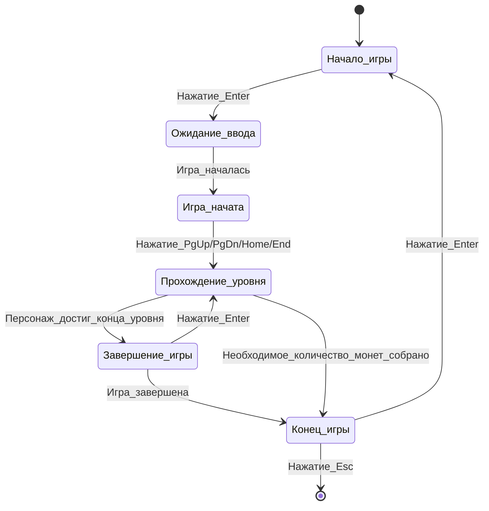
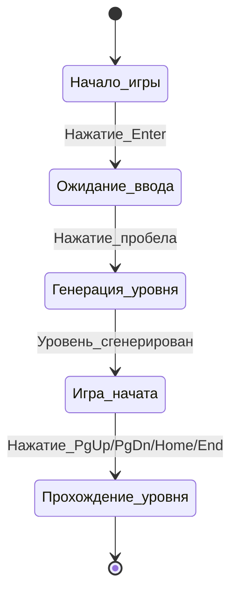
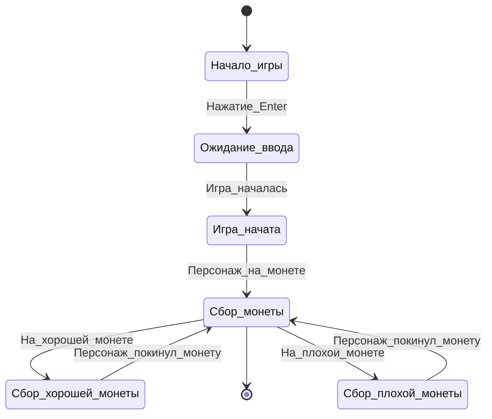
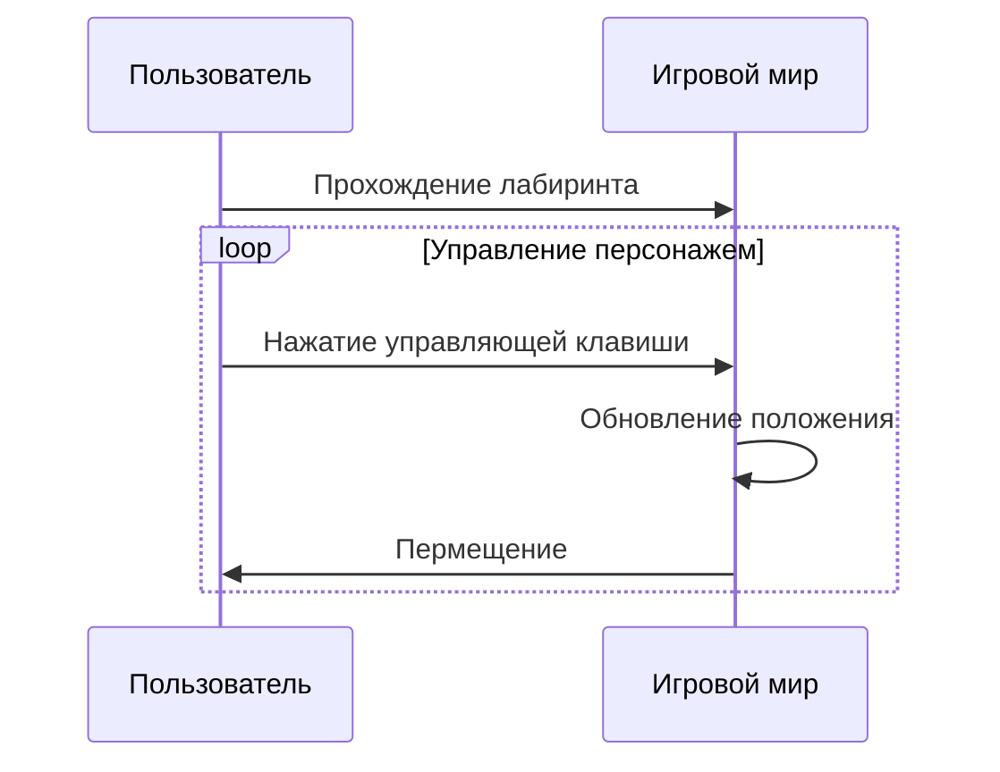

# Поведенческие модели
**Диаграммы состояний**

1. **Начало**: Начальное состояние.
2. **Ожидание ввода**: Нажатие_Enter.
3. **Игра начата**: Игра_началась.
4. **Прохождение уровня**: Нажатие_PgUp/PgDn/Home/End.
5. **Завершение игры**: Персонаж_достиг_конца_уровня.
6. **Конец игры**: Игра_завершена.
7. **Завершение игры**: Нажатие_Enter.
8. **Конец игры**: Необходимое_количество_монет_собрано.
9. **Конец игры**: Конец: Нажатие_Esc.

1. **Начало**: Начальное состояние.
2. **Ожидание ввода**: Нажатие_Enter.
3. **Генерация уровня**: Нажатие_пробела.
4. **Игра начата**: Уровень_сгенерирован.
5. **Прохождение уровня**: Конец.

1. **Начало**: Начальное состояние.
2. **Ожидание ввода**: Нажатие_Enter.
3. **Игра начата**: Игра_началась.
4. **Сбор монеты**: Персонаж_на_монете.
5. **Сбор хорошей монеты**: На_хорошей_монете.
6. **Сбор плохой монеты**: На_плохой_монете.
7. **Сбор монеты**: Персонаж_покинул_монету.
8. **Сбор монеты**: Конец.

**Диаграмма последовательности**

Описание: Пользователь проходит лабиринт. ПАользователь нажимает клавишу управления. Игровой мир обновлят положение персонажа. Пользователь перемещается.
