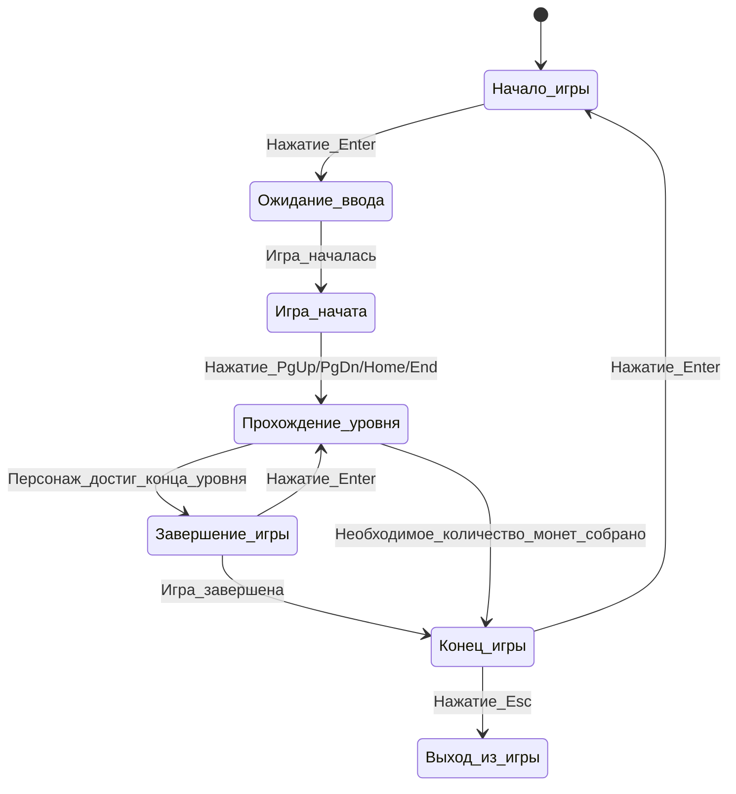
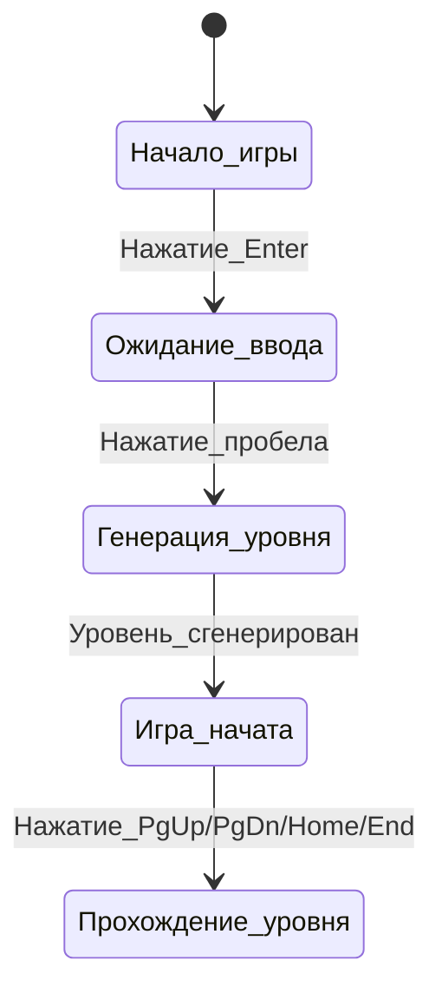
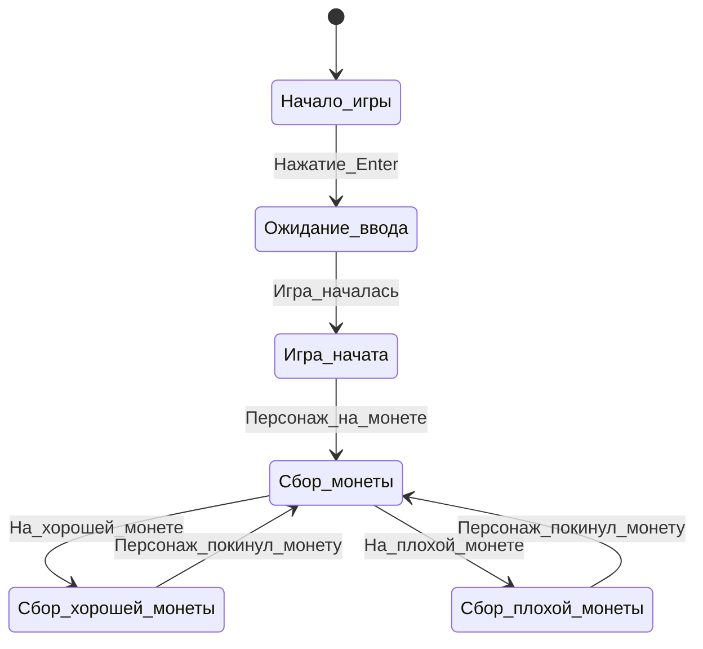
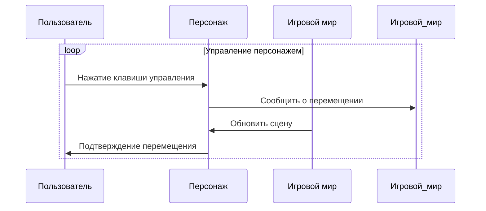

# Поведенческие модели
**Диаграммы состояний**

```mermaid
stateDiagram
    [*] --> Начало_игры
    Начало_игры --> Ожидание_ввода: Нажатие_Enter
    Ожидание_ввода --> Игра_начата: Игра_началась
    Игра_начата --> Прохождение_уровня: Нажатие_PgUp/PgDn/Home/End
    Прохождение_уровня --> Завершение_игры: Персонаж_достиг_конца_уровня
    Завершение_игры --> Конец_игры: Игра_завершена
    Завершение_игры --> Прохождение_уровня: Нажатие_Enter
    Прохождение_уровня --> Конец_игры: Необходимое_количество_монет_собрано
    Конец_игры --> Начало_игры: Нажатие_Enter
    Конец_игры --> Выход_из_игры: Нажатие_Esc
```

```mermaid
stateDiagram
    [*] --> Начало_игры
    Начало_игры --> Ожидание_ввода: Нажатие_Enter
    Ожидание_ввода --> Генерация_уровня: Нажатие_пробела
    Генерация_уровня --> Игра_начата: Уровень_сгенерирован
    Игра_начата --> Прохождение_уровня: Нажатие_PgUp/PgDn/Home/End
```

```mermaid
stateDiagram
    [*] --> Начало_игры
    Начало_игры --> Ожидание_ввода: Нажатие_Enter
    Ожидание_ввода --> Игра_начата: Игра_началась
    Игра_начата --> Сбор_монеты: Персонаж_на_монете
    Сбор_монеты --> Сбор_хорошей_монеты: На_хорошей_монете
    Сбор_монеты --> Сбор_плохой_монеты: На_плохой_монете
    Сбор_хорошей_монеты --> Сбор_монеты: Персонаж_покинул_монету
    Сбор_плохой_монеты --> Сбор_монеты: Персонаж_покинул_монету
```

**Диаграмма последовательности**

```mermaid
sequenceDiagram
    participant Пользователь
    participant Персонаж
    participant Игровой мир

    loop Управление персонажем
        Пользователь ->> Персонаж: Нажатие клавиши управления
        Персонаж ->> Игровой_мир: Сообщить о перемещении
        Игровой мир ->> Персонаж: Обновить сцену
        Персонаж ->> Пользователь: Подтверждение перемещения
    end

```
