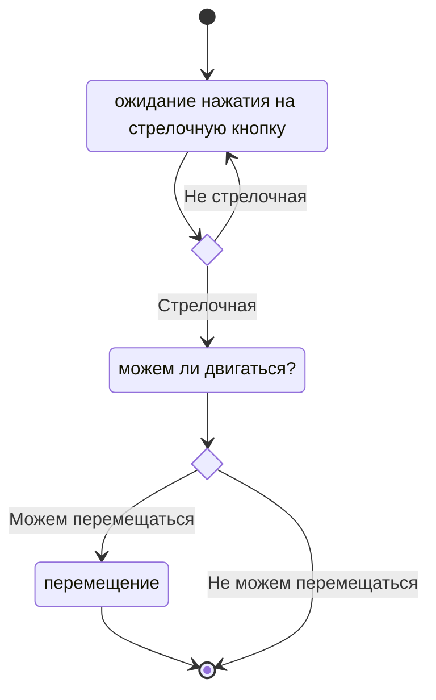
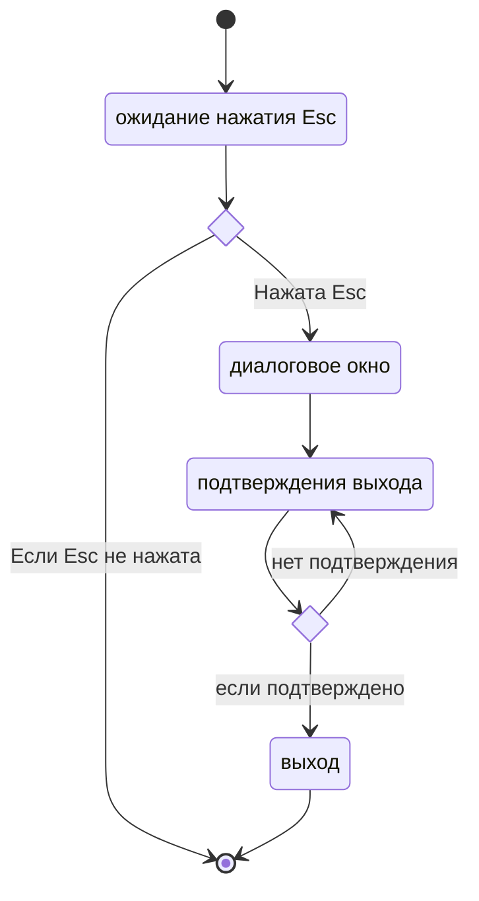
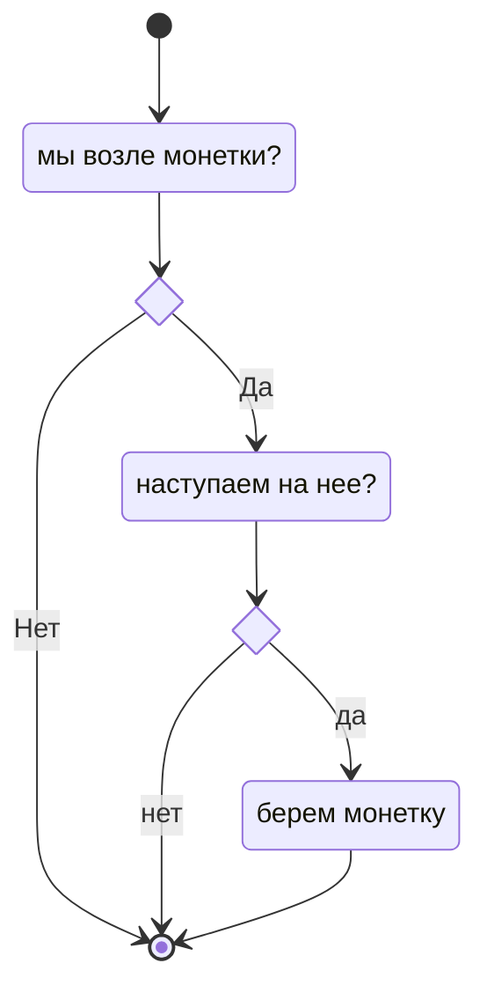
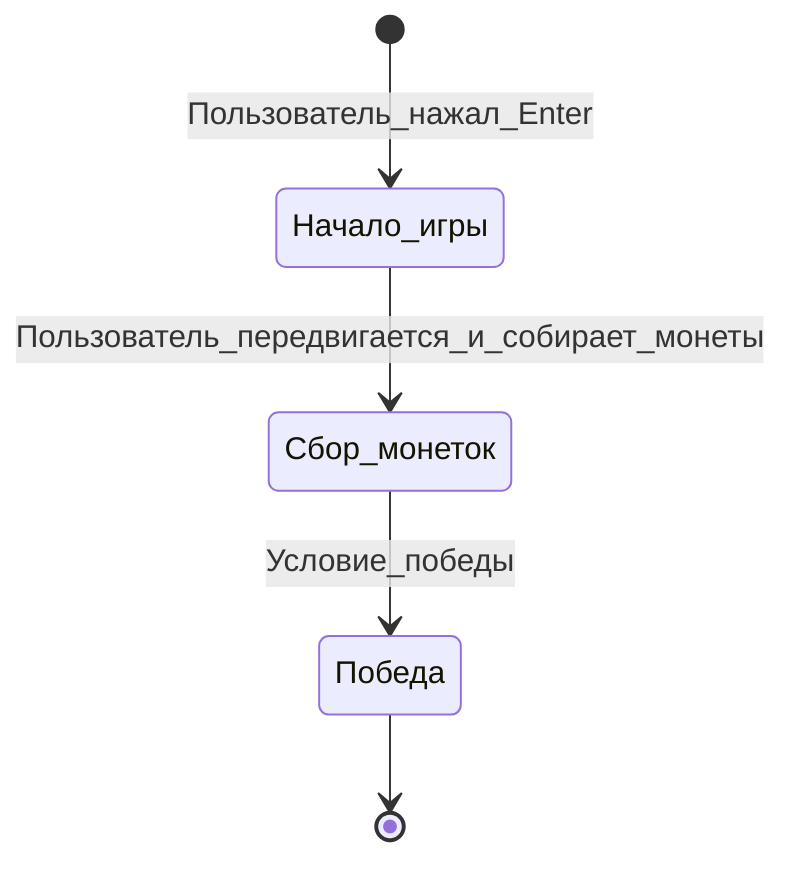
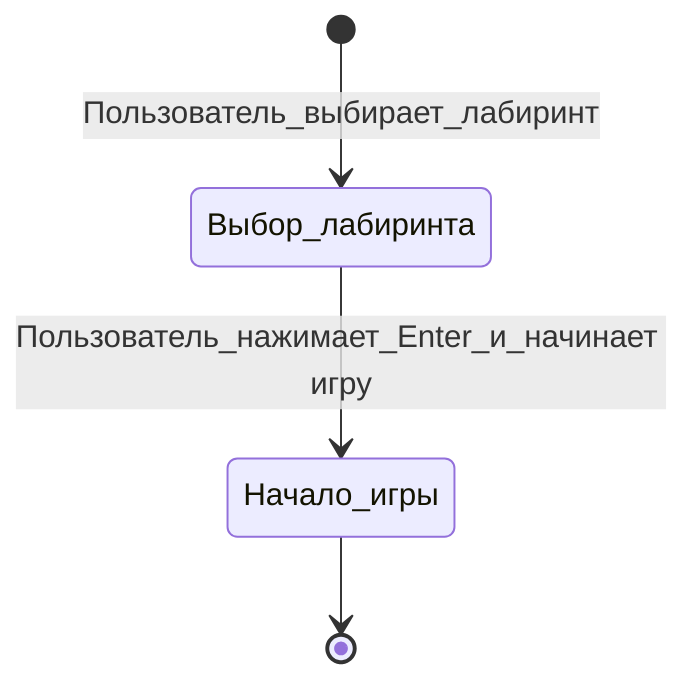
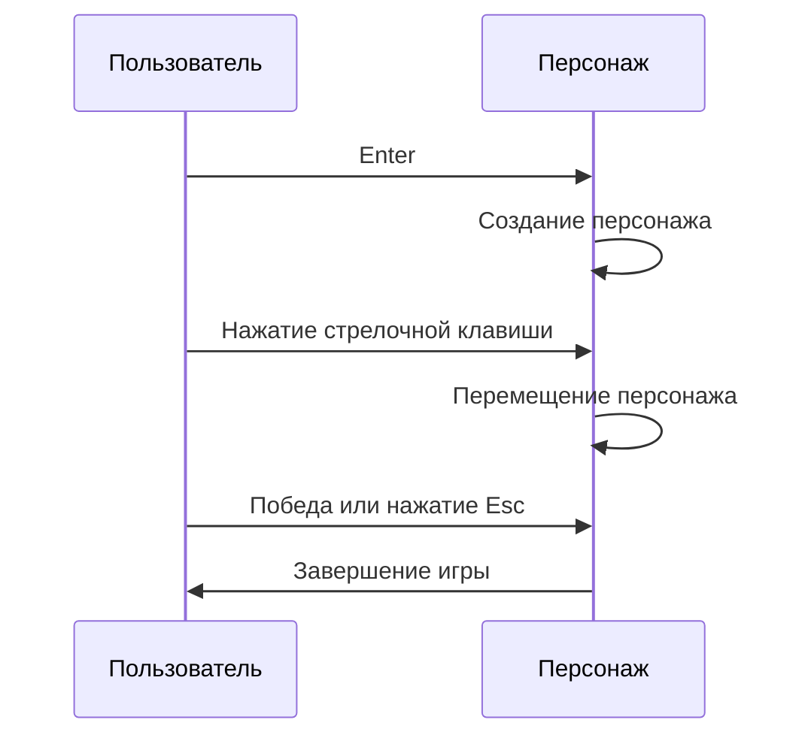

Функциональные модели
1. Начало игры 
 пользователь нажимает Enter, приложение начинает игру
 пользователь нажимает пробел, приложение генерирует лабиринт 
2. Прохождение лабиринта
 пользователь нажимает PgUp, приложение перемещает вверх 
 пользователь PgDn, приложение пермещает вниз 
 пользователь нажимаеь Home, приложение перемещает влево
 пользователь нажимает End, приложение перемещает вправо
3. Сбор монет
 пользователь наступает на "хорошую" монетку, приложение увеличивает количество монет 
 пользователь наступает на "плохую" монетку, приложение уменьшает количество монет
4. Завершение игры 
 пользователь дошел до конца лабиринта, приложение завершает игру и выводит сообщение о завершении 
 пользователь набрал необходимое количество монет, приложение завершает игру и выводит сообщение о завершении
 пользователь нажмает Esc, приложение завершает игру и выводит сообщение о завершении

