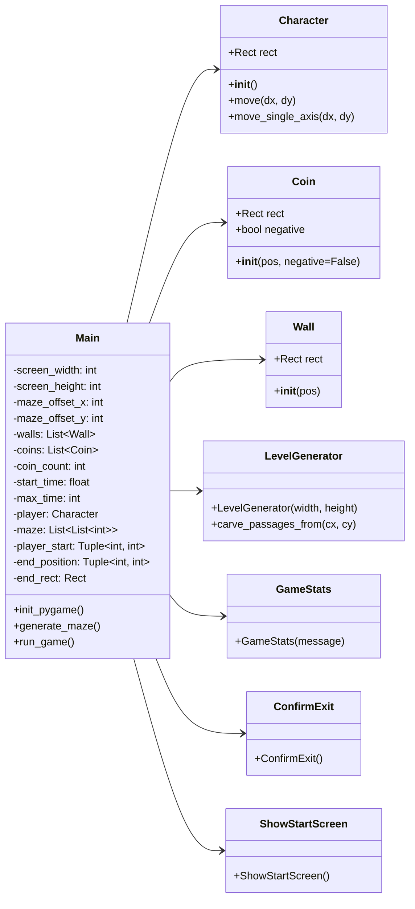

# Структурные модели

### Character
    `rect`: прямоугольная область для отслеживания позиции игрока.
    `init()`: инициализация игрока.
    `move(dx, dy)`: перемещение игрока.
    `move_single_axis(dx, dy)`: перемещение игрока вдоль одной оси и проверка столкновений.

### Coin
    `rect`: прямоугольная область для отслеживания позиции монеты.
    `negative`: указывает, является ли монета отрицательной.
    `init(pos, negative=False)`: инициализация монеты.
    
### Wall
    `rect`: прямоугольная область для отслеживания позиции стены.
    `init(pos)`: инициализация стены.

### LevelGenerator
    `LevelGenerator(width, height)`: генерация лабиринта.
    `carve_passages_from(cx, cy)`: вспомогательная функция для вырезания путей в лабиринте.

### GameStats
    `GameStats(message)`: отображение статистики игры.

### ConfirmExit
    `ConfirmExit()`: подтверждение выхода из игры.

### ShowStartScreen
    `ShowStartScreen()`: отображение начального экрана.

### Main
    `screen_width`: ширина экрана.
    `screen_height`: высота экрана.
    `maze_offset_x`: смещение лабиринта по оси X.
    `maze_offset_y`: смещение лабиринта по оси Y.
    `walls`: список стен.
    `coins`: список монет.
    `coin_count`: счетчик монет.
    `start_time`: время начала игры.
    `max_time`: максимальное время игры.
    `player`: объект игрока.
    `maze`: двумерный список, представляющий лабиринт.
    `player_start`: начальная позиция игрока.
    `end_position`: конечная позиция лабиринта.
    `end_rect`: прямоугольная область для конечной позиции.
    `init_pygame()`: инициализация pygame.
    `generate_maze()`: генерация лабиринта.
    `run_game()`: запуск основного цикла игры.

### Диаграмма объектов

### Описание 
## Описание UML диаграммы игры (на русском)

### Объекты и их атрибуты:

* Game (Игра):
    * Initial coordinate (Изначальная координата): Стартовая позиция персонажа на уровне.
    * Generated level (Сгенерированный уровень): Объект, хранящий информацию о структуре уровня, включая расположение стен, монет, препятствий и т.д.
    * Timer 120 seconds (Таймер 120 секунд): Отслеживает оставшееся время игры.
* LevelGenerator (Генератор уровня):
    * Level generator (Генератор уровня): Функциональность, отвечающая за создание игрового уровня.
* Character (Персонаж):
    * Character position х, у (Позиция персонажа): Текущие координаты (x, y) персонажа на уровне.
    * Direction of movement (Направление движения): Указывает направление, в котором движется персонаж.
* Timer (Таймер):
    * Changes in seconds (Изменяется в секундах): Оставшееся время игры, уменьшается каждую секунду.
    * The maximum time - 120 seconds (Максимальное время - 120 секунд): Начальное значение таймера.
* GameStats (Статистика игры):
    * Number of coins collected (Количество собранных монет): Отслеживает количество монет, собранных игроком.
    * Maximum number - 20 (Максимальное количество - 20): Общее количество монет на уровне.
* Point (Точка):
    * Coordinates of the current position (Координаты текущего положения): Координаты (x, y) текущей позиции персонажа.
    * Coordinates after movement (Координаты, куда будет передвижение): Координаты (x, y) целевой позиции после движения.

### Взаимодействия:

* Game использует LevelGenerator для создания уровня.
* Game управляет Character, изменяя его позицию и направление движения.
* Game использует Timer для отслеживания времени игры.
* Game использует GameStats для хранения статистики игры.
* Character использует Point для определения своего текущего положения и целевой позиции при движении.

### Особенности диаграммы:

* Диаграмма отражает основные объекты игры и их атрибуты. 
* Показаны зависимости между объектами (например, Game использует LevelGenerator, Character использует Point).
* Не показаны методы объектов, что ограничивает полноту описания.

### Дополнительные возможности:

* Добавить классы для представления других элементов игры, таких как монеты, препятствия и т.д.
* Указать методы объектов, которые определяют их поведение.
* Использовать другие типы UML диаграмм, например, диаграммы классов или диаграммы последовательности, для более детального описания структуры и поведения игры.
