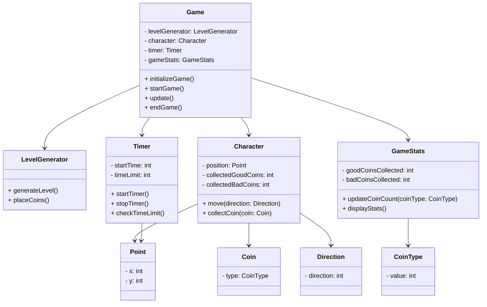

# Структурные модели

### Game (Игра):
- **levelGenerator**: Используется для генерации уровня и размещения монет.
- **character**: Представляет игрового персонажа, управляет его движениями и сбором монет.
- **timer**: Отслеживает время игры и обработку ограничения времени.
- **gameStats**: Хранит статистику игры, такую как количество собранных монет.
- Методы:
  - `initializeGame()`: Инициализирует игру перед началом.
  - `startGame()`: Запускает игру.
  - `update()`: Обновляет состояние игры на каждом кадре.
  - `endGame()`: Завершает игру.

### LevelGenerator (Генератор уровней):
- Методы:
  - `generateLevel()`: Размещает монеты и создает новый игровой уровень.
  - `placeCoins()`: Размещает монеты на уровне.

### Character (Персонаж):
- **position**: Хранит текущую позицию персонажа.
- **collectedGoodCoins**: Хранит количество собранных хороших монет.
- **collectedBadCoins**: Хранит количество собранных плохих монет.
- Методы:
  - `move(direction: Direction)`: Перемещает персонажа в указанном направлении.
  - `collectCoin(coin: Coin)`: Обрабатывает сбор монеты.

### Timer (Таймер):
- **startTime**: Хранит время запуска таймера.
- **timeLimit**: Хранит ограничение времени игры.
- Методы:
  - `startTimer()`: Запускает таймер.
  - `stopTimer()`: Останавливает таймер.
  - `checkTimeLimit()`: Проверяет, истекло ли ограничение времени.

### GameStats (Статистика игры):
- **goodCoinsCollected**: Хранит количество собранных хороших монет.
- **badCoinsCollected**: Хранит количество собранных плохих монет.
- Методы:
  - `updateCoinCount(coinType: CoinType)`: Обновляет количество собранных монет.
  - `displayStats()`: Отображает статистику игры.

### Point (Точка):
- x: Координата по оси X.
- y: Координата по оси Y.

### Direction (Направление):
- `direction`: Направление движения персонажа.

### Coin (Монета):
- `type`: Тип монеты.

### CoinType (Тип монеты):
- `value`: Значение типа монеты.

### Диаграмма объектов

### Описание 
## Описание UML диаграммы игры (на русском)

### Объекты и их атрибуты:

* Game (Игра):
    * Initial coordinate (Изначальная координата): Стартовая позиция персонажа на уровне.
    * Generated level (Сгенерированный уровень): Объект, хранящий информацию о структуре уровня, включая расположение стен, монет, препятствий и т.д.
    * Timer 120 seconds (Таймер 120 секунд): Отслеживает оставшееся время игры.
* LevelGenerator (Генератор уровня):
    * Level generator (Генератор уровня): Функциональность, отвечающая за создание игрового уровня.
* Character (Персонаж):
    * Character position х, у (Позиция персонажа): Текущие координаты (x, y) персонажа на уровне.
    * Direction of movement (Направление движения): Указывает направление, в котором движется персонаж.
* Timer (Таймер):
    * Changes in seconds (Изменяется в секундах): Оставшееся время игры, уменьшается каждую секунду.
    * The maximum time - 120 seconds (Максимальное время - 120 секунд): Начальное значение таймера.
* GameStats (Статистика игры):
    * Number of coins collected (Количество собранных монет): Отслеживает количество монет, собранных игроком.
    * Maximum number - 20 (Максимальное количество - 20): Общее количество монет на уровне.
* Point (Точка):
    * Coordinates of the current position (Координаты текущего положения): Координаты (x, y) текущей позиции персонажа.
    * Coordinates after movement (Координаты, куда будет передвижение): Координаты (x, y) целевой позиции после движения.

### Взаимодействия:

* Game использует LevelGenerator для создания уровня.
* Game управляет Character, изменяя его позицию и направление движения.
* Game использует Timer для отслеживания времени игры.
* Game использует GameStats для хранения статистики игры.
* Character использует Point для определения своего текущего положения и целевой позиции при движении.

### Особенности диаграммы:

* Диаграмма отражает основные объекты игры и их атрибуты. 
* Показаны зависимости между объектами (например, Game использует LevelGenerator, Character использует Point).
* Не показаны методы объектов, что ограничивает полноту описания.

### Дополнительные возможности:

* Добавить классы для представления других элементов игры, таких как монеты, препятствия и т.д.
* Указать методы объектов, которые определяют их поведение.
* Использовать другие типы UML диаграмм, например, диаграммы классов или диаграммы последовательности, для более детального описания структуры и поведения игры.
