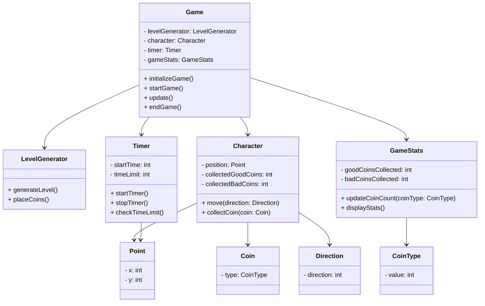

# Структурные модели

### Game (Игра):
- **levelGenerator**: Используется для генерации уровня и размещения монет.
- **character**: Представляет игрового персонажа, управляет его движениями и сбором монет.
- **timer**: Отслеживает время игры и обработку ограничения времени.
- **gameStats**: Хранит статистику игры, такую как количество собранных монет.
- Методы:
  - `initializeGame()`: Инициализирует игру перед началом.
  - `startGame()`: Запускает игру.
  - `update()`: Обновляет состояние игры на каждом кадре.
  - `endGame()`: Завершает игру.

### LevelGenerator (Генератор уровней):
- Методы:
  - `generateLevel()`: Размещает монеты и создает новый игровой уровень.
  - `placeCoins()`: Размещает монеты на уровне.

### Character (Персонаж):
- **position**: Хранит текущую позицию персонажа.
- **collectedGoodCoins**: Хранит количество собранных хороших монет.
- **collectedBadCoins**: Хранит количество собранных плохих монет.
- Методы:
  - `move(direction: Direction)`: Перемещает персонажа в указанном направлении.
  - `collectCoin(coin: Coin)`: Обрабатывает сбор монеты.

### Timer (Таймер):
- **startTime**: Хранит время запуска таймера.
- **timeLimit**: Хранит ограничение времени игры.
- Методы:
  - `startTimer()`: Запускает таймер.
  - `stopTimer()`: Останавливает таймер.
  - `checkTimeLimit()`: Проверяет, истекло ли ограничение времени.

### GameStats (Статистика игры):
- **goodCoinsCollected**: Хранит количество собранных хороших монет.
- **badCoinsCollected**: Хранит количество собранных плохих монет.
- Методы:
  - `updateCoinCount(coinType: CoinType)`: Обновляет количество собранных монет.
  - `displayStats()`: Отображает статистику игры.

### Point (Точка):
- x: Координата по оси X.
- y: Координата по оси Y.

### Direction (Направление):
- `direction`: Направление движения персонажа.

### Coin (Монета):
- `type`: Тип монеты.

### CoinType (Тип монеты):
- `value`: Значение типа монеты.

