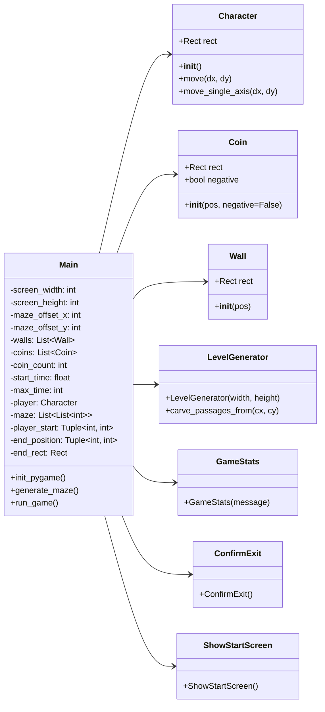

# Структурные модели

## Cделать описание внутренней структуры приложения

### Character
- `rect`: прямоугольная область для отслеживания позиции игрока.
- `init()`: инициализация игрока.
- `move(dx, dy)`: перемещение игрока.
- `move_single_axis(dx, dy)`: перемещение игрока вдоль одной оси и проверка столкновений.

### Coin
- `rect`: прямоугольная область для отслеживания позиции монеты.
- `negative`: указывает, является ли монета отрицательной.
- `init(pos, negative=False)`: инициализация монеты.
    
### Wall
- `rect`: прямоугольная область для отслеживания позиции стены.
- `init(pos)`: инициализация стены.

### LevelGenerator
- `LevelGenerator(width, height)`: генерация лабиринта.
- `carve_passages_from(cx, cy)`: вспомогательная функция для вырезания путей в лабиринте.

### GameStats
- `GameStats(message)`: отображение статистики игры.

### ConfirmExit
- `ConfirmExit()`: подтверждение выхода из игры.

### ShowStartScreen
- `ShowStartScreen()`: отображение начального экрана.

### Main
- `screen_width`: ширина экрана.
- `screen_height`: высота экрана.
- `maze_offset_x`: смещение лабиринта по оси X.
- `maze_offset_y`: смещение лабиринта по оси Y.
- `walls`: список стен.
- `coins`: список монет.
- `coin_count`: счетчик монет.
- `start_time`: время начала игры.
- `max_time`: максимальное время игры.
- `player`: объект игрока.
- `maze`: двумерный список, представляющий лабиринт.
- `player_start`: начальная позиция игрока.
- `end_position`: конечная позиция лабиринта.
- `end_rect`: прямоугольная область для конечной позиции.
- `init_pygame()`: инициализация pygame.
- `generate_maze()`: генерация лабиринта.
- `run_game()`: запуск основного цикла игры.

## Диаграмма объектов

```mermaid
classDiagram
    class Character {
        +pygame.Surface image
        +pygame.Rect rect
        +__init__()
        +move(dx, dy, walls)
        Атрибуты:
        - размер: 16x16 пикселей
        - цвет: оранжевый
        - начальная позиция: (32, 32)
    }
    
    class Coin {
        +pygame.Rect rect
        +boolean negative
        +__init__(pos, negative=False)
        Атрибуты:
        - размер: 10x10 пикселей
        Свойства:
        - Положительная монета: увеличивает счетчик монет на 1
        - Отрицательная монета: уменьшает счетчик монет на 1 (минимум 0)
    }

    class Wall {
        +pygame.Surface image
        +pygame.Rect rect
        +__init__(position)
        Атрибуты:
        - размер: 16x16 пикселей
        - цвет: синий
    }

    class Timer {
        +int max_time = 120
        +int current_time = 0
        +start_timer()
        +increment_time()
        +check_time()
        Поведение:
        - Начинает отсчет от 0 до 120 секунд с шагом 1 секунда после запуска игры
    }

    class GameStats {
        +GameStats(screen, font, message, coin_count, screen_width, screen_height)
    }

    class initialize_game {
        +initialize_game()
        Атрибуты:
        - Размер экрана: 740x580
        - Смещение лабиринта: maze_offset_x = 0, maze_offset_y = 50
    }

    class generate_maze_and_elements {
        +generate_maze_and_elements(maze_width, maze_height, maze_offset_x, maze_offset_y, player)
        Атрибуты:
        - Размер лабиринта: maze_width = 40, maze_height = 30
    }


    class move_player {
        +move_player(player, walls, key_state=None)
    }

    class check_coin_collection {
        +check_coin_collection(player, coins, coin_count)
        Свойства:
        - Положительная монета: coin_count + 1
        - Отрицательная монета: coin_count - 1
        - Максимум: coin_count = 20
    }

    class check_game_end {
        +check_game_end(player, end_rect, coin_count, start_time, screen, font, screen_width, screen_height, max_time)
        Условия:
        - Условие победы: coin_count >= 20
        - Условие поражения: истекло max_time или игрок достиг конца лабиринта
    }

    class draw_scene {
        +draw_scene(screen, walls, coins, player, end_rect, coin_count, elapsed_time, screen_width)
    }

    initialize_game --> Character : создает
    initialize_game --> Wall : создает
    initialize_game --> Coin : создает
    initialize_game --> generate_maze_and_elements : вызывает
    generate_maze_and_elements --> Character : инициализация
    generate_maze_and_elements --> Wall : инициализация
    generate_maze_and_elements --> Coin : инициализация
    move_player --> Character : вызывает
    check_coin_collection --> Coin : обновляет
    check_game_end --> GameStats : обновляет
    draw_scene --> Character : рисует
    draw_scene --> Wall : рисует
    draw_scene --> Coin : рисует
    Timer --> check_game_end : взаимодействие
```

## Описание 

### Character 
- Атрибуты:
`image`: поверхность изображения персонажа размером 16x16 пикселей, оранжевого цвета
`rect`: прямоугольник, описывающий позицию и размер персонажа
Начальная позиция: (32, 32)
- Методы:
`__init__()`: инициализация персонажа
`move(dx, dy, walls)`: перемещение персонажа с учетом столкновений со стенами

### Coin
- Атрибуты:
`rect`: прямоугольник, описывающий позицию и размер монеты 10x10 пикселей
`negative`: булево значение, указывающее, является ли монета отрицательной
- Методы:
`__init__(pos, negative=False)`: инициализация монеты
- Свойства:
Положительная монета: увеличивает счетчик монет на 1
Отрицательная монета: уменьшает счетчик монет на 1 (минимум 0)

### Wall 
- Атрибуты:
`image`: поверхность изображения стены размером 16x16 пикселей, синего цвета
`rect`: прямоугольник, описывающий позицию и размер стены
- Методы:
`__init__(position)`: инициализация стены на заданной позиции

### Timer (Таймер)
- Атрибуты:
`max_time` = 120: максимальное время в секундах
`current_time` = 0: текущее время в секундах
- Методы:
`start_timer()`: запуск таймера
`increment_time()`: увеличение времени на 1 секунду
`check_time()`: проверка текущего времени относительно max_time
- Поведение:
Начинает отсчет от 0 до 120 секунд с шагом 1 секунда после запуска игры
Основной игровой цикл:

### Инициализация игры:
`initialize_game()`: инициализация экрана и основных объектов
Размер экрана: 740x580
Смещение лабиринта: maze_offset_x = 0, maze_offset_y = 50
`generate_maze_and_elements()`: генерация лабиринта, стен и монет
Размер лабиринта: maze_width = 40, maze_height = 30
`ShowStartScreen()`: показ стартового экрана

### Игровой процесс:
`handle_events()`: обработка событий (выход, пауза)
`move_player()`: перемещение игрока
`check_coin_collection()`: проверка сбора монет
Положительная монета: coin_count + 1
Отрицательная монета: coin_count - 1
Максимум: coin_count = 20
`check_game_end()`: проверка условий окончания игры
Условие победы: coin_count >= 20
Условие поражения: истекло max_time или игрок достиг конца лабиринта
`draw_scene()`: отрисовка текущего состояния игры

### Счетчик монет:
Начальное значение: 0
Положительные монеты: +1 к счетчику
Отрицательные монеты: -1 к счетчику (минимум 0)
Максимальное значение: 20